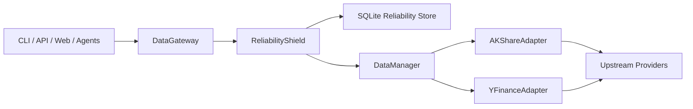

# StockPilot Data Reliability Design

**Date:** 2026-04-17  
**Status:** Approved for planning  
**Topic:** Reliability-first data access for CLI, API, web, and agents

## Summary

StockPilot already has a `DataManager`, adapter routing, and cache primitives, but reliability behavior is uneven: price history has basic failover, other read paths do not; cache freshness is implicit; source health is not remembered across requests; and upstream failures still surface as user-visible instability.

The chosen design is a **reliability shield over the current adapters**, not a rewrite and not a separate data platform. The first implementation adds a `DataGateway` entrypoint for the read paths already used by the product, backed by a `ReliabilityShield`, a local SQLite reliability store, and explicit `fresh` / `stale` / `unavailable` response semantics.

Phase 1 is intentionally narrow: **one configured live source per domain/market plus stale-cache fallback**. True multi-source live fallback and live-result merging are explicitly deferred until later. This keeps the system local-first, avoids new services, preserves existing adapter contracts, and gives every consumer the same degradation behavior.

## Problem

Today, StockPilot can succeed or fail depending on which upstream data source happens to respond at request time. The main issues are:

1. failover is inconsistent across domains
2. cache hits do not tell consumers whether data is fresh or stale
3. source failures are forgotten immediately, so bad sources keep getting retried
4. consumers cannot distinguish "temporary upstream outage" from "legitimate empty result"
5. reliability behavior is spread between adapters, `DataManager`, and API handlers instead of being centralized

The result is avoidable 500/503-style experiences, weak operator visibility, and inconsistent behavior between CLI, API, web, and agent flows.

## Goals

1. Reduce user-visible failures for existing read paths.
2. Make data freshness explicit and consistent everywhere.
3. Reuse the current adapter layer and `DataManager` patterns instead of replacing them.
4. Persist cache and source-health decisions locally so behavior improves across requests and restarts.
5. Keep the solution simple: Python + SQLite, no required Redis, no extra daemons.

## Non-Goals

This enhancement does **not** include:

1. live trading or execution-engine changes
2. a full historical warehouse or snapshot pipeline
3. broad new dataset expansion beyond the read paths already used by CLI/web/agents
4. rewriting existing adapters into a new provider framework
5. introducing mandatory infrastructure such as Redis, Kafka, or separate broker services
6. multi-source live-result merging across adapters in phase 1

## Current Baseline

The design builds on the code that already exists:

- `src/stockpilot/data/manager.py` centralizes adapter registration, routing, and some cache usage
- `src/stockpilot/data/cache.py` already provides cache abstractions
- adapters such as `AKShareAdapter` and `YFinanceAdapter` already normalize provider output
- tests already cover market-aware cache keys and price-history fallback behavior

The new work should sit above those pieces and standardize reliability behavior across domains.

## Chosen Approach

Add a **Data Gateway** in front of the current data manager and let that gateway delegate fetches through a **Reliability Shield**. The shield owns cache freshness rules, source health, fallback order, and normalized degradation metadata. Existing adapters remain responsible for talking to providers and returning normalized data.



## Architecture and Boundaries

### 1. `DataGateway`

`DataGateway` is the new public entrypoint for reliability-aware reads. It should expose explicit methods for the domains that need uniform behavior:

- `get_price_history(...)`
- `get_realtime_quote(...)`
- `get_realtime_quotes(...)`
- `get_fundamental_data(...)`
- `get_stock_list(...)`
- `search(...)`

Its job is small and clear: accept a request, pick the correct domain policy, call the shield, and return a structured result. It does **not** parse provider payloads and does **not** decide UI wording.

Canonical domain IDs for config, cache keys, health rows, and error payloads are:

- `price_history`
- `realtime_quote`
- `realtime_quotes`
- `fundamental_data`
- `stock_list`
- `search`

Gateway method names map one-to-one onto those IDs.

### 2. `ReliabilityShield`

`ReliabilityShield` is the policy engine. It owns:

1. cache lookup and freshness evaluation
2. source eligibility based on health state
3. fallback routing across adapters
4. result classification: success, empty, partial, error
5. conversion into a common result/error contract
6. persistence of cache metadata and source-health updates

It does **not** know provider-specific fetch details. It only orchestrates policy around adapter calls.

### 3. `SourceRegistry`

`SourceRegistry` holds the ordered adapter policy per domain and market. It resolves questions like:

- which adapters are eligible for A-share price history?
- which source is preferred for US fundamentals?

This keeps static source ordering out of route handlers and avoids scattered `if market == ...` logic. `SourceRegistry` does **not** inspect live health state; it only returns the configured candidate order for a request.

### 4. `ReliabilityStore`

`ReliabilityStore` is a local SQLite-backed persistence layer. It stores:

1. cached payload metadata and payload bodies
2. source-health state per adapter/domain/market

No external service is required. Redis can remain an optional cache backend for other use cases, but this reliability enhancement must work correctly with SQLite alone.

### 5. Existing Adapters and `DataManager`

Adapters keep their current job: fetch and normalize provider responses. `DataManager` remains the adapter-routing utility and can still be used internally by the shield. The design does not require adapter rewrites beyond any small compatibility hooks needed for richer error classification.

### 6. Adapter classification contract

To keep the first implementation small, adapters do not need a new provider framework, but gateway-managed domains do need a minimal, explicit contract for classification:

1. **normal success**: adapter returns a normalized non-empty payload
2. **acceptable empty**: adapter returns an empty payload only where the domain allows it
3. **typed exception**: adapter may raise a small data-layer exception that clearly maps to `caller_error`, `disabled_source`, or `source_response_error`
4. **generic exception**: any untyped exception is classified by the shield as `transient_source_error`

Phase 1 should add a tiny exception vocabulary in the data layer for adapters that can distinguish intent:

- `CallerDataError`
- `DisabledDataSourceError`
- `CoverageEmptyData`
- `SourceResponseError`

`CoverageEmptyData` is the explicit signal for "this request is valid, the source is healthy, but the source has no coverage for it". That matters most for `get_fundamental_data`, where a bare empty dict is ambiguous and should be treated as a `source_response_error` unless the adapter explicitly signals `CoverageEmptyData`.

Adapters are not required to use every typed exception on day one. The important rule is that when an adapter can distinguish a caller problem, disabled source, or valid no-coverage result from a transient outage, it should use the typed signal so the shield can avoid bad health decisions.

### 7. Interface contract between units

For gateway-managed domains, the responsibilities are intentionally split:

| Unit | Input | Output | Owns | Does not own |
| --- | --- | --- | --- | --- |
| `DataGateway` | domain request + caller options | `DataResult[T]` or `ReliabilityError` | public entrypoints and caller-facing method names | source ordering, adapter internals |
| `SourceRegistry` | domain + market + explicit adapter override | ordered `SourceCandidate[]` | static source policy and market/domain applicability | health transitions, live filtering, cache, fetch execution |
| `ReliabilityShield` | `DomainRequest` + `SourceCandidate[]` | `DataResult[T]` or `ReliabilityError` | cache decisions, health checks, fallback orchestration, result classification | provider-specific fetch logic |
| `DataManager` | adapter name or market | concrete adapter instance | adapter registration and lookup | gateway policy for managed domains |
| Adapter | domain method arguments | normalized dataframe/dict/list | provider calls and provider-specific normalization | cross-source fallback policy |

The critical rule is: **for gateway-managed domains, `DataManager` is treated as an adapter registry and lookup utility, not the policy owner**. `SourceRegistry` decides the configured candidate order, `ReliabilityShield` decides whether each candidate should be tried now, `DataManager` returns the adapter instance, and the adapter performs the fetch.

Legacy `DataManager` routing methods can remain for non-gateway callers during rollout, but new reliability-aware read paths should not rely on `DataManager` to decide failover order.

## Domain Coverage and Cache Classes

The first rollout only covers the read paths already used by the product. Each domain maps to a cache class with a fresh window and a stale window.

| Cache class | Domains in scope | Fresh window | Stale window | Notes |
| --- | --- | --- | --- | --- |
| `live_quote` | `realtime_quote`, `realtime_quotes` | 15 seconds | 2 minutes | For interactive UI/CLI views only. |
| `session_series` | `price_history` when the request includes the current session | 5 minutes | until session close plus 30 minutes | Protects active charts from flaky upstream calls. |
| `historical_series` | `price_history` for closed historical ranges | 24 hours | 30 days | Historical data is comparatively stable. |
| `reference_data` | `fundamental_data`, `stock_list`, `search` | 24 hours | 7 days | Slow-moving metadata can degrade gracefully. |

These windows are config-driven, but the implementation plan should start with the values above.

### Session detection and market-calendar fallback

`session_series` needs deterministic classification without adding a heavy calendar dependency. Phase 1 should use a small in-process market-session helper:

| Market | Time zone | Session rule |
| --- | --- | --- |
| `a_share` | `Asia/Shanghai` | Weekdays, `09:30-11:30` and `13:00-15:00` |
| `us` | `America/New_York` | Weekdays, `09:30-16:00` |

Rules:

1. if `end_date` is before "today" in the market time zone, classify as `historical_series`
2. if the request includes "today" and the market is in a nominal session window or within 30 minutes after close, classify as `session_series`
3. if the request includes "today" but the market is outside session hours, classify as `historical_series`
4. weekends are always treated as non-session days and therefore classify as `historical_series`
5. phase 1 does not model exchange holidays; weekday requests during nominal session hours are treated as `session_series`
6. if the market has no session rule or time-zone conversion fails, fall back to `historical_series`

Phase 1 does **not** add holiday-aware calendars. When the helper is uncertain, it should err toward `historical_series`, which is safer than falsely treating a request as live-session data.

## Request Lifecycle

Each reliability-aware request follows the same flow:

1. `DataGateway` builds a domain request object from symbol, market, range, and caller options.
2. `ReliabilityShield` computes a deterministic cache key and looks up the local store.
3. If the cache entry is still inside the fresh window, return it as `fresh`.
4. Otherwise, ask `SourceRegistry` for candidate adapters in configured order, then let `ReliabilityShield` filter or demote candidates based on health state.
5. Call each candidate once. Do not use aggressive retry loops; fallback is preferred over repeated hammering of the same source.
6. For each result, classify it as `success`, `empty`, `partial`, or `error`.
7. On the first acceptable live success, update source health, write cache metadata/body, and return `fresh`.
8. If all live attempts fail but an older cache entry is still inside the stale window, return that cached payload as `stale`.
9. If no acceptable cache entry exists, return `unavailable` with a normalized error envelope.

In phase 1, there is only one configured live candidate per domain/market. The lifecycle still uses the registry/shield boundary so later phases can extend it, but phase-1 requests never perform same-market live fallback across multiple adapters.

## `fresh` / `stale` / `unavailable` Contract

### Success result shape

Every reliability-aware success should carry both the payload and status metadata:

```json
{
  "status": "fresh",
  "result_kind": "data",
  "source": "akshare",
  "served_from_cache": false,
  "fetched_at": "2026-04-17T09:35:00Z",
  "age_seconds": 0,
  "degraded_reason": null,
  "missing_symbols": [],
  "attempted_sources": [
    {"adapter": "akshare", "outcome": "success"}
  ],
  "data": "..."
}
```

For stale results, `status` becomes `stale`, `served_from_cache` is `true`, and `degraded_reason` explains why cached data was used.

### Status meaning

| Status | Meaning | Consumer behavior |
| --- | --- | --- |
| `fresh` | Live fetch succeeded, or cache is still inside the fresh window. | Use normally. |
| `stale` | No fresh live result was available, but a cached result is still acceptable. | Use with a visible warning or confidence downgrade. |
| `unavailable` | Neither a live result nor an acceptable cached result was available. | Surface a structured failure. |

### Result kinds

`status` tells consumers whether the result is fresh or degraded. `result_kind` tells them what shape of usable payload they received.

| `result_kind` | Meaning |
| --- | --- |
| `data` | Normal non-empty payload |
| `empty` | Request succeeded but legitimately returned no rows/items |
| `partial` | Batch request succeeded for only a subset of requested symbols |

### Per-domain behavior matrix

| Domain | Acceptable empty? | Partial allowed? | Final rule |
| --- | --- | --- | --- |
| `price_history` | Yes, but only after all live sources return empty and no source returns non-empty data | No | If any source returns data, use it. If all sources return empty, return `fresh` + `result_kind=empty`. If live sources error and a stale cache exists, return `stale`. Do not replace an all-empty live result with stale historical cache. |
| `realtime_quote` | No | No | Empty dict is treated as invalid and counts as an error for fallback and health classification. |
| `realtime_quotes` | No fully empty batch; yes for subset payloads | Yes | If at least one requested symbol is returned, return `fresh` + `result_kind=partial` and list `missing_symbols`. In phase 1 the shield does not merge partial batches across sources. When `require_complete=true`, any missing symbols become `dataset_incomplete`. If no symbols are returned, treat as error. |
| `fundamental_data` | Yes, but only when the adapter explicitly raises `CoverageEmptyData` | No | Accept explicit coverage-empty as `fresh` + `result_kind=empty`. Bare empty dicts, missing required keys, or malformed payloads are errors. |
| `stock_list` | No | No | Empty list/dataframe is invalid and triggers fallback or failure. |
| `search` | Yes | No | Empty search results are valid and return `fresh` + `result_kind=empty`. |

This avoids poisoning source health with false failures while still giving consistent final outcomes.

## Source Health and Fallback Routing

Each adapter/domain/market combination has its own health state.

| State | Meaning | Selection behavior |
| --- | --- | --- |
| `healthy` | Normal operation | Eligible at normal priority |
| `degraded` | Recent failures above threshold but not yet open-circuit | Eligible, but after healthy sources |
| `cooling_down` | Circuit is open after repeated failures | Skipped until cooldown expires |
| `recovering` | Source is being probed after cooldown | Eligible for limited probe traffic |
| `disabled` | Not configured or not supported for the domain/market | Never selected |

### State transitions

1. A source starts as `healthy`.
2. Repeated request errors move it to `degraded`.
3. Continued failures move it to `cooling_down` with `cooldown_until`.
4. After cooldown, a probe request moves it to `recovering`.
5. Two consecutive successes in `recovering` return it to `healthy`.
6. A failure during `recovering` returns it to `cooling_down`.

Initial thresholds:

- degrade after 2 consecutive errors
- cool down after 3 consecutive errors
- default cooldown window: 120 seconds
- recover after 2 consecutive successes

These thresholds are intentionally simple and local-first. They do not require distributed coordination.

### Failure taxonomy

Only failures that reflect source instability or source-quality problems should affect health:

| Class | Examples | Health impact |
| --- | --- | --- |
| `transient_source_error` | timeout, connection reset, rate limit, upstream 5xx | increments failure counters |
| `source_response_error` | malformed payload, schema drift, invalid empty payload for the domain | increments failure counters |
| `caller_error` | invalid symbol format, invalid date range, unsupported market requested by caller | no health impact |
| `coverage_empty` | explicit `CoverageEmptyData` result where the domain allows empty | no health impact |
| `disabled_source` | adapter not configured, credentials missing, unsupported domain/market | no health impact; source stays `disabled` |

`NotImplementedError` and explicit unsupported-market cases should map to `disabled_source`, not to a failing source. For `get_realtime_quotes`, a partial batch with some missing symbols does not by itself count as a source failure unless the provider also returned a transport or payload error.

### Routing rules

1. Routing is domain-specific and market-specific.
2. Healthier sources are preferred over degraded ones.
3. A `recovering` source gets probe traffic only when its cooldown has expired, and only one probe attempt per domain/market is allowed at a time; a successful probe increments recovery counters and a failed probe returns the source to `cooling_down`.
4. Explicit `adapter_name` requests are allowed in phase 1 only when the name matches the configured source for that domain/market. That request is attempted exactly once, is recorded normally, and does not fall back further. Any other adapter name returns `invalid_request`.
5. Existing adapter-internal fallbacks remain internal. For example, if `AKShareAdapter` already falls back between upstream endpoints, that still counts as one adapter attempt at the gateway level.

Phase 1 uses one configured live adapter per domain/market. The routing model still uses `SourceRegistry` so later phases can add true same-market secondary sources, but that is out of scope for this design.

## Normalized Error Envelope

When the shield cannot return either a fresh or stale result, it should produce a consistent error payload:

```json
{
  "status": "unavailable",
  "code": "DATA_SOURCE_UNAVAILABLE",
  "message": "No acceptable data source was available for the request",
  "domain": "price_history",
  "symbol": "000001",
  "market": "a_share",
  "attempted_sources": [
    {"adapter": "akshare", "outcome": "error", "reason": "ConnectionError"}
  ],
  "cache_state": {
    "present": true,
    "freshness": "expired",
    "age_seconds": 9800
  },
  "retry_after_seconds": 120
}
```

### Other error contracts

Not every failed request is `unavailable`. Gateway-managed paths should use four explicit error families:

| Status | HTTP status | When used |
| --- | --- | --- |
| `invalid_request` | 400 | semantic caller problems discovered after schema validation, such as an invalid market/symbol combination |
| `not_found` | 404 | the request is valid but a required symbol/range has no usable data |
| `unavailable` | 503 | no acceptable live or stale result exists |
| `dataset_incomplete` | 503 | a batch result is only `partial` but the endpoint requires a complete dataset |

`invalid_request` uses the same envelope shape with `code="DATA_REQUEST_INVALID"` and must not mutate source health. `not_found` uses `code="DATA_NOT_FOUND"`. `dataset_incomplete` uses `code="DATASET_INCOMPLETE"` and includes `missing_symbols` when relevant.

### Consumer mapping

- **API**: reliability errors use `HTTPException(status_code=<400-or-404-or-503>, detail=<normalized error envelope>)` according to the error family above
- **CLI**: render the message plus attempted sources and retry hint
- **Web**: show a non-crashing degraded-state panel with retry guidance
- **Agents**: treat the failure as a missing input and lower confidence rather than crashing the whole analysis graph where possible

## Consumer Integration Rules

The reliability shield only standardizes data access. Presentation stays with each consumer:

1. API routes that return JSON append a top-level `data_status` object as a sibling of the existing payload fields.
2. CLI commands show a compact warning when status is `stale`.
3. Backtests can use cached historical series normally, but if the requested range includes the current session and the result is `stale`, the run should say that current-session data may be lagging.
4. Agent runs receive freshness metadata so the final narrative can mention reduced confidence when stale inputs were used.

This preserves the current product UX while making reliability visible.

### Exact API success contract

For successful JSON responses, `data_status` has this shape:

```json
{
  "data_status": {
    "status": "fresh",
    "result_kind": "data",
    "source": "akshare",
    "served_from_cache": false,
    "fetched_at": "2026-04-17T09:35:00Z",
    "age_seconds": 0,
    "degraded_reason": null,
    "missing_symbols": [],
    "attempted_sources": [
      {"adapter": "akshare", "outcome": "success"}
    ]
  }
}
```

Rules:

1. `data_status` is always top-level on successful JSON responses that used the gateway.
2. `status` is only `fresh` or `stale` on success; `partial` is represented through `result_kind`.
3. Endpoints that require a complete dataset for all requested symbols or runs, such as compare, backtest-compare, and portfolio optimization, must convert partial upstream results into HTTP 503 instead of returning a misleading 200.
4. Endpoints where partial data is still useful, such as watchlist-style quote views, may return 200 with `result_kind=partial` and `missing_symbols` populated.
5. Pydantic/body-shape validation remains unchanged and continues to use normal FastAPI 422 responses; the reliability layer only owns semantic data-access outcomes after request validation.
6. Gateway batch methods should expose `require_complete`; completeness-required endpoints set it to `true`, which converts any partial batch into `dataset_incomplete` in phase 1.

### Aggregation rules for multi-load routes

Routes such as compare, backtest-compare, and portfolio optimization load multiple single-symbol `price_history` results. In phase 1 they use this route-level aggregation:

1. if every required symbol returns `result_kind=data`, the route succeeds with HTTP 200
2. route-level `data_status.status` is `stale` if any required symbol is stale; otherwise it is `fresh`
3. route-level `data_status.source` is the single source name if every required symbol used the same source; otherwise it is `"mixed"`
4. route-level `data_status.attempted_sources` is a flattened per-symbol summary in the form `{"symbol": "...", "adapter": "...", "outcome": "..."}` so provenance is not lost
5. if any required symbol returns `result_kind=empty`, the route returns HTTP 404 with `status="not_found"` and `code="DATA_NOT_FOUND"`
6. if any required symbol returns `status="unavailable"`, the route returns HTTP 503 with `status="unavailable"`

### Example success variants

Fresh from cache:

```json
{
  "data_status": {
    "status": "fresh",
    "result_kind": "data",
    "source": "cache:akshare",
    "served_from_cache": true,
    "fetched_at": "2026-04-17T09:20:00Z",
    "age_seconds": 45,
    "degraded_reason": null,
    "missing_symbols": [],
    "attempted_sources": []
  }
}
```

Stale fallback:

```json
{
  "data_status": {
    "status": "stale",
    "result_kind": "data",
    "source": "cache:akshare",
    "served_from_cache": true,
    "fetched_at": "2026-04-17T09:10:00Z",
    "age_seconds": 700,
    "degraded_reason": "live sources unavailable; serving cached payload",
    "missing_symbols": [],
    "attempted_sources": [
      {"adapter": "akshare", "outcome": "error", "reason": "ConnectionError"}
    ]
  }
}
```

Partial batch success:

```json
{
  "data_status": {
    "status": "fresh",
    "result_kind": "partial",
    "source": "yfinance",
    "served_from_cache": false,
    "fetched_at": "2026-04-17T09:35:00Z",
    "age_seconds": 0,
    "degraded_reason": null,
    "missing_symbols": ["MSFT"],
    "attempted_sources": [
      {"adapter": "yfinance", "outcome": "partial"}
    ]
  }
}
```

## Storage Design

Use one local SQLite database dedicated to reliability metadata and persisted cache. Two tables are enough for the first implementation:

### `cache_entries`

- `cache_key`
- `domain`
- `market`
- `request_params_json`
- `subject_key`
- `adapter`
- `result_kind`
- `fetched_at`
- `fresh_until`
- `stale_until`
- `payload_format`
- `payload_body`
- `payload_meta_json`

### `source_health`

- `adapter`
- `domain`
- `market`
- `state`
- `consecutive_errors`
- `consecutive_successes`
- `last_success_at`
- `last_failure_at`
- `cooldown_until`
- `last_error_type`

That is enough to persist decisions across restarts without building a broader observability system.

`cache_key` is always a deterministic hash of `domain + normalized request_params_json`. `subject_key` is a nullable human-readable hint:

- single-symbol requests: the symbol
- batch quotes: the sorted symbol list joined by commas
- search: the keyword
- stock list: the market name

The cache identity comes from `cache_key`, not from `subject_key`, so list and batch domains are handled consistently. `result_kind` stores `data`, `empty`, or `partial`. `payload_meta_json` stores round-trip metadata that belongs to the cached payload, especially `missing_symbols` for partial batch results and any row-count/item-count hints needed by the reader.

`request_params_json` must be canonicalized with sorted keys, ISO-8601 date strings, normalized market values, sorted symbol lists for batch requests, and `adapter_name`. Auto-routed requests use `adapter_name="auto"`. Explicit adapter overrides read and write only their own cache entries; they never consume cached results created for `auto` or for another adapter name.

### `ReliabilityStore` interface

The store needs a small operational API so planners do not have to invent coordination rules:

1. `get_cache_entry(cache_key) -> CacheEntry | None`
2. `put_cache_entry(cache_key, payload, result_kind, meta, fetched_at, fresh_until, stale_until, adapter) -> None`
3. `get_source_health(adapter, domain, market) -> SourceHealth`
4. `record_source_success(adapter, domain, market, at) -> SourceHealth`
5. `record_source_failure(adapter, domain, market, error_class, at) -> SourceHealth`
6. `begin_probe(adapter, domain, market, at) -> bool`

Semantics:

- cache read/write is atomic per `cache_key`
- health updates are atomic per `adapter + domain + market`
- `begin_probe(...)` is a compare-and-set operation inside a SQLite transaction so only one recovery probe is active for a source/domain/market tuple at a time
- `status` on read is computed from `fresh_until` / `stale_until`; it is not stored separately

### Store failure behavior

Phase 1 treats SQLite reliability persistence as fail-open for live reads:

1. cache read failure behaves like a cache miss
2. cache write failure does not fail a successful live response; the response is returned and persistence is skipped
3. health read failure uses an in-request default of `healthy`
4. health write failure does not fail the request; it only drops that health update
5. if the store cannot be opened at all, the gateway continues in stateless mode for the process lifetime and stale-cache fallback becomes unavailable until the store is healthy again

## Configuration

The feature should be config-driven from existing config surfaces. The implementation plan should add reliability settings under the data configuration with:

1. SQLite file path
2. cache-class windows
3. source order per domain/market
4. health thresholds and cooldown settings

Configuration is part of the feature, but the first rollout should ship with sane local defaults so no manual setup is required.

### Initial source-order matrix

The first implementation should ship with this default registry:

| Domain | A-share order | US order | Cross-market fallback |
| --- | --- | --- | --- |
| `price_history` | `akshare` | `yfinance` | not allowed |
| `realtime_quote` | `akshare` | `yfinance` | not allowed |
| `realtime_quotes` | `akshare` | `yfinance` | not allowed |
| `fundamental_data` | `akshare` | `yfinance` | not allowed |
| `stock_list` | `akshare` | `yfinance` | not allowed |
| `search` | `akshare` | `yfinance` | not allowed |

Phase 1 uses only the single source shown above for each market/domain pair. Later phases may append same-market secondary sources by configuration. The registry must never silently fall back from `a_share` to `us` or vice versa.

## Rollout Order

Implement in this order:

1. Introduce `DataGateway`, `ReliabilityShield`, and `ReliabilityStore` for the read paths already used by CLI, web, API, and agents.
2. Add source registry, health tracking, and cache-class policy by domain.
3. Propagate freshness metadata into API responses and then into CLI/web/agent presentation.
4. After the shield is stable, consider onboarding additional domains, new adapters, and true same-market secondary-source fallback.

This order keeps the change small, gives immediate user-visible reliability gains, and avoids mixing the reliability work with dataset expansion.

## Testing Strategy

The implementation plan should include tests at three levels.

### Unit tests

Cover:

1. cache fresh/stale expiration decisions by cache class
2. health state transitions and cooldown behavior
3. source ordering with healthy/degraded/cooling-down sources
4. empty-result classification versus hard-error classification
5. explicit `adapter_name` behavior
6. `require_complete` converting partial batches into `dataset_incomplete`

### Contract tests

Cover:

1. `DataGateway` result shape for `fresh`, `stale`, and `unavailable`
2. normalized error envelope shape
3. API response compatibility when `data_status` metadata is added
4. preservation of current adapter normalization contracts

### End-to-end tests

Cover:

1. primary source success
2. primary source failure with stale cache fallback
3. primary source failure with no acceptable cache, returning `unavailable`
4. partial batch accepted for a partial-friendly endpoint
5. partial batch rejected with `dataset_incomplete` for a completeness-required endpoint
6. restart persistence: cached data and source health survive process restart

## Phase 1 Consumer Touchpoints

Phase 1 should wire the gateway into these existing surfaces:

| Surface | Touchpoint | Domain(s) | `require_complete` |
| --- | --- | --- | --- |
| CLI | `analyze`, `chart`, `backtest` | `price_history`, `fundamental_data` | `false` |
| CLI | `search` | `search` | `false` |
| API/Web | stock analysis and chart-data routes | `price_history`, `fundamental_data` | `false` |
| API/Web | compare route | repeated `price_history` loads for requested symbols | `true` at the route level |
| API/Web | backtest-compare route | repeated `price_history` loads for requested symbols | `true` at the route level |
| API/Web | portfolio optimization route | repeated `price_history` loads for requested symbols | `true` at the route level |
| API/Web | watchlist or multi-quote summary views | `realtime_quotes` | `false` |
| Agents | single-symbol agent analysis flows | `price_history`, `fundamental_data`, `search` as needed | `false` |

## Acceptance Criteria

The enhancement is ready for implementation when the plan can satisfy all of these:

1. Existing adapters remain usable without a rewrite.
2. The main read paths expose explicit `fresh` / `stale` / `unavailable` behavior.
3. Source health survives across requests and across app restarts.
4. Successful degraded responses no longer look identical to fresh ones.
5. Upstream failures stop producing raw stack-trace-style user experiences in normal product flows.

## Why This Is the Right Scope

This design is intentionally narrow. It solves the current pain point — flaky data access — without turning StockPilot into a full data platform. The gateway/shield/store split gives clear boundaries, keeps the change understandable, and creates a stable base for later coverage work if the reliability layer proves useful.
